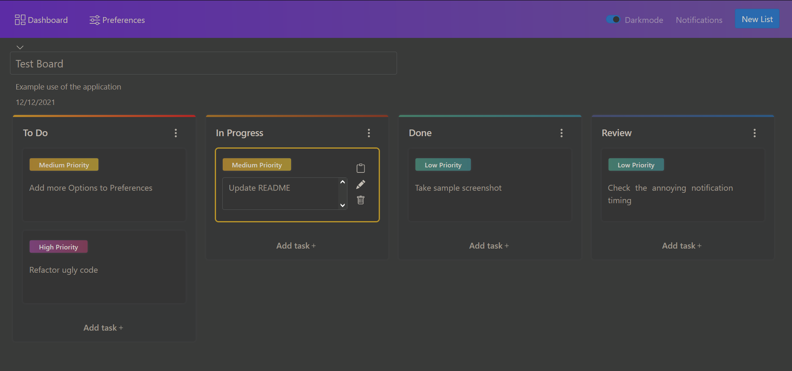

# Kanbanity

## Kanban board Application built with [Vue.js 2](https://github.com/vuejs/vue)
### Some of the features

* Create boards
* Create lists in board
* Create items / tasks in list
* Set task priority
* Drag a task to another list, or drag a whole list to change its order
* Add notifications (only browser-based using Notification API)
* Manage preferences including board templates
* You can do all this in dark mode! 🌙

### Some technologies used include

* Vuex with Vuex ORM
* BootstrapVue
* Typescript
* Vuelidate



> As this is a frontend only application, all data is stored in LocalStorage in the user's browser

## Project setup
```
npm install
```

### Compiles and hot-reloads for development
```
npm run serve
```

### Compiles and minifies for production
```
npm run build
```

### Lints and fixes files
```
npm run lint
```

### Customize configuration
See [Configuration Reference](https://cli.vuejs.org/config/).

### Disclaimer
The initial design and backbone is based on the [application](https://github.com/ayazsayyed/vue-kanban) written by [@ayazsayyed](https://github.com/ayazsayyed).
